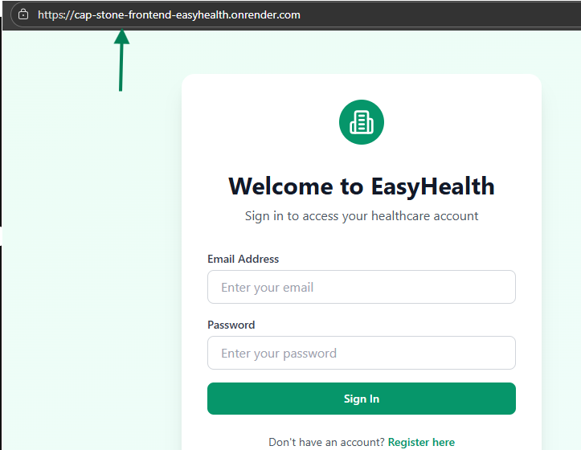

# **Render Deployment Plan (Comprehensive Guide)**

## **1. Prerequisites**

Before deploying, ensure you have:

### **Tools**

* **Git** for version control
* **GitHub/GitLab/Bitbucket repository** (Render pulls from these)
* **Docker (optional)** if deploying via Docker image
* **Environment variable file (.env)**
* **Render account**

### **Application Requirements**

* Working application 
* Proper **start command** (e.g., `npm run build`)
* Production-ready configuration (database URI, allowed hosts)

---

# **2. Setup and Configuration**

## **2.1 Create Production Environment Configuration**

Define environment variables required for production:

* `DATABASE_URL`
* `SECRET_KEY`
* `PORT`

## **2.2 Prepare Code for Deployment**

* Ensure  `package.json`,  file is present
* Commit and push code to GitHub

---

# **3. Deployment on Render**

## **3.1 Create a New Web Service**

1. Log in to **Render**
2. Click **"New" → "Web Service"**
3. Connect your repo (GitHub)
4. Select the branch to deploy (usually `main`)

## **3.2 Configure Service Settings**

### **Build & Runtime**

* **Runtime:** Auto-detected (Node)
* **Build Command:**

  * Node: `npm install`
* **Start Command:**

  * Node: `npm start`

### **Instance Type & Scaling**

* Choose: **Free**, **Starter**, or **Standard** plan ("free plan used")

### **Environment Variables**

Add all variables from Step 2.1:

* In **Environment → Add Environment Variable**
* Paste key/value pairs

# **4. Build & Deployment Process**

Once you click **Create Web Service**, Render will:

### **4.1 Build Phase**

* Pull your repo
* Install dependencies
* Run build command
* Prepare production environment

### **4.2 Deploy Phase**

* Start the server with the configured start command
* Make the app accessible at a public Render URL

If any step fails, Render provides logs in the **Events** tab.

---

# **5. Post-Deployment Verification**

## **5.1 Functional Testing**

* Open the deployed URL
* Test all major functionality:

  * API endpoints return correct responses
  * UI loads correctly (if frontend)
  * Database operations work
  * Authentication flows successful

## **5.2 Log Monitoring**

Check logs in Render:

* **Logs → Live Logs**
* Confirm no runtime errors
* Verify successful build and application start

## **5.3 Health Checks**

Verify:

* Response time and uptime
* Error-free responses
  Render also includes built-in health monitoring.

---

# **7. Final Verification & Documentation**

## **7.1 Deployment Verification Checklist**

✔ App is accessible at public URL
✔ All routes/pages/API endpoints function
✔ Database connected and persistent
✔ Environment variables set correctly
✔ No critical errors in logs
✔ Proper restart and scaling behavior

## **7.2 Screenshot of deployed test**

