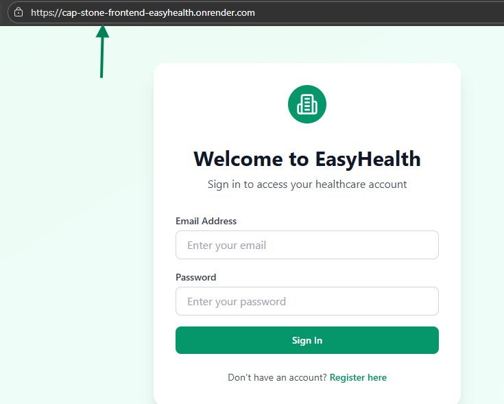
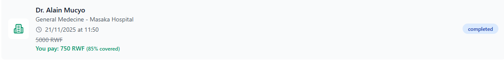
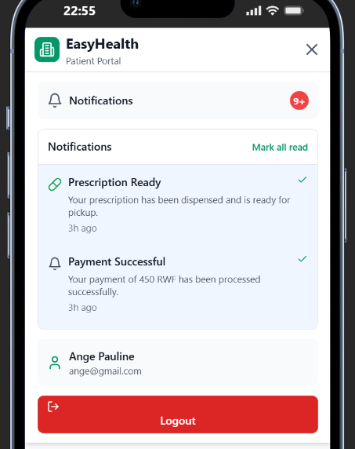
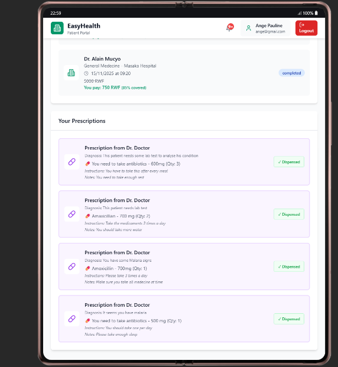
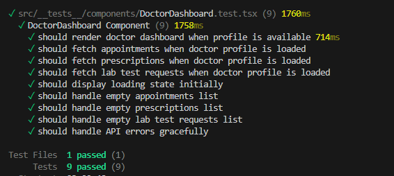

# **Centralized Hospital Service System**

*A project aimed at reducing fragmented hospital services by providing a unified digital platform for patient–hospital interactions.*

---

## 🚀 **Project Overview**

This system was developed to centralize essential hospital services that were traditionally scattered across multiple platforms or handled manually. The goal was to create a single, unified system where patients can book appointments, receive notifications, pay consultation fees, and access prescriptions with ease.

The project achieved **approximately 85%** of its intended objectives, successfully demonstrating the feasibility and impact of such a centralized solution within the context of the case study.

---

## ✅ **Key Features Implemented**

### **1. Centralized Hospital Services**

A unified platform was developed to reduce fragmented service delivery. Patients can now access all major services appointments, payments, notifications, and prescriptions—in one system.

**How it was achieved:**

* Conducted requirement analysis to identify fragmented workflows.
* Designed a system architecture that integrates major hospital processes.
* Implemented a user-friendly interface for accessibility.

---

### **2. Online Appointment Booking**

Patients can easily:

* Choose a doctor
* Select available time slots
* Book appointments online

This reduces hospital congestion and enhances convenience.

---

### **3. Consultation Payment Workflow**

The system supports the full payment workflow at the software level, including:

* Displaying consultation charges
* Initiating payment requests
* Tracking payment status

Though real-time mobile money payments were not integrated, the payment logic is fully functional for simulation.

---

### **4. Automated Notifications**

The system notifies patients regarding:

* Appointment confirmations
* Payment updates
* Prescription availability
* Consultation progress

This improves communication and reduces missed appointments.

---

### **5. Digital Prescription Access**

Doctors can issue electronic prescriptions directly within the system. Patients can download or view these prescriptions instantly, eliminating delays and reliance on paper-based processes.

---

## ⚠️ **Objectives Not Fully Achieved**

### **1. Mobile Money API Integration**

**Planned:** Real-time payments using MTN Mobile Money or Airtel Money.
**Reason Not Achieved:**

* Requires paid commercial registration not feasible within the project budget.
* Real API access is restricted for non-commercial systems.

*Note: The system architecture fully supports later integration once resources are available.*

---

### **2. RSSB Database Integration**

**Planned:** Validate insurance coverage and automate claim verification.
**Reason Not Achieved:**

* RSSB does not provide open access to health insurance databases.
* Requires institutional agreements and legal permissions.
* The project was limited to a case study environment.

Simulated workflows were used to demonstrate the intended functionality.

---

## 📊 **Overall Evaluation**

### **Successes**

* Successfully centralized patient services.
* Improved accessibility and reduced manual hospital processes.
* Demonstrated strong potential for real-world deployment.
* Provided a working prototype showcasing concept feasibility.

### **Challenges**

* External financial and institutional requirements prevented API integration.
* Some real-time operations remain as simulations.

### **Impact**

Despite these limitations, the system achieved its core purpose — proving that scattered hospital services can be unified into a functional and efficient digital platform.

---

## 🏁 **Conclusion**

The project effectively addressed the issue of fragmented hospital services by implementing a centralized digital system. With 85% of objectives achieved, the prototype demonstrates:

* Improved service delivery
* Better patient experience
* Real potential for national-level scalability

The components that were not implemented were restricted by external factors such as funding and data access, not by system design limitations. Overall, the project met its academic and practical objectives, offering a strong foundation for future development.

---

## 📌 **Future Improvements**

;

---
Backend Deployed version: https://easy-health-backend.onrender.com/api-docs/
--
Link to Frontend deployed version : https://cap-stone-frontend-easyhealth.onrender.com
--
Demo Video: https://vimeo.com/1138991174
